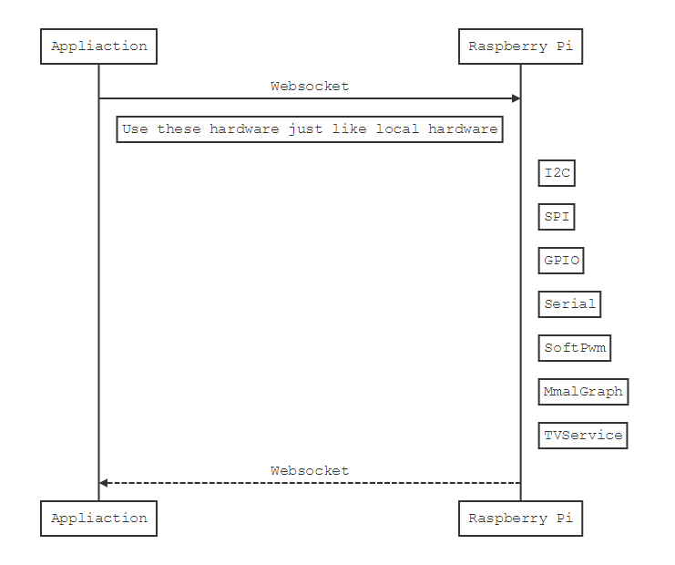

Raspi-io
========
Using websocket control your raspberry pi, raspberry pi side needs running an  [RaspiIOServer](https://github.com/amaork/raspi-ios "RaspiIOServer") instance.




## Features

- Support Python 2.7+, Python3+
- Support I2C, API same as [pylibi2c](https://github.com/amaork/libi2c)
- Support SPI, API same as [Spidev](https://github.com/doceme/py-spidev) and support SPIFlash
- Support GPIO、Software PWM, API same as [RPi.GPIO](https://sourceforge.net/projects/raspberry-gpio-python/)
- Support display image on LCD or HDMI via Multi-Media Abstraction Layer
- Support HDMI video settings, power on/off, get monitor supported modes etc
- Support query raspi hardware information, such as: Serial No.、MAC address, device list etc

## Installation

1. First install [raspi-ios](https://github.com/amaork/raspi-ios) on your raspberry pi, and create an `RaspiIOServer` instance

2. Second install Pillow

    ```bash
    $ sudo apt-get install libjpeg-dev
    $ sudo pip install Pillow
    ```

3. Finally install `raspi-io` on your computer

    ```bash
    $ git clone https://github.com/amaork/raspi-io.git
    $ cd raspi-io
    $ sudo python setup.py install
    ```

    or

    ```bash
    $ sudo apt-get install libjpeg-dev
    $ sudo pip install git+https://github.com/amaork/raspi-io.git
    ```

## Default port

`raspi_io` default using port **`9876`** communicate with [RaspiIOServer](https://github.com/amaork/raspi-ios "RaspiIOServer"), but if `RaspiIOServer` port changed, your can specify default port like this:

```python
import raspi_io
raspi_io.core.DEFAULT_PORT = 39876
```

## Interface
    Query: query raspi info

    GPIO: usage same as RPi.GPIO

    SoftPWM: usage same as RPi.GPIO.PWM

    Serial: support read/write/close/flushInput/flushOutput

    I2C: support open/read/write/ioctl_read/ioctl_write

    SPI: support open/close/read/write/xfer/xfer2

    SPIFlash support probe/erase/read_chip/write_chip

    MmalGraph: display image on LCD or HDMI

    TVService: raspberry pi video setting, set HDMI mode

    RaspberryManager: create RaspiWsClient instance

## RaspberryManager
```python
from raspi_io import *
from raspi_io.utility import scan_server

# Scan LAN raspi-io server
servers = scan_server()
manager = RaspberryManager(servers[0])

# Create Query instance
query = manager.create(Query)

# Create I2C instance
i2c = manager.create(I2C, "/dev/i2c-1", 0x56)

# Create serial instance
s = manager.create(Serial, port="/dev/ttyUSB0", baudrate=115200)
```

## I2C Usage
```python
import ctypes
from raspi_io import I2C
from raspi_io.utility import scan_server

# Open /dev/i2c-1, you can using Query.get_i2c_list() get i2c bus list
i2c = I2C(scan_server()[0], '/dev/i2c-1', 0x56)

# Python2, 3, both can using ctypes.create_string_buffer() create a buffer
buf = ctypes.create_string_buffer(256)

# Python3 can using bytes, create a buffer
buf = bytes(256)

# Write
if i2c.write(0x0, buf) != len(buf):
    print(i2c.get_error())

# Read from i2c, Python2 return str, Python3 return bytes
r_buf = i2c.read(0x0, 256)

# Print data
i2c.print_binary(r_buf, 16)
```

## SPI Usage
```python
from raspi_io.utility import scan_server
from raspi_io import SPI, Query, SPIFlash
from raspi_io.spi_flash import SPIFlashInstruction

address = scan_server()[0]
device = Query(address).get_spi_list()[-1]
spi = SPI(address, device, max_speed=8000)

# Probe SPI Flash JEDEC ID
data = spi.xfer([0x9f], 3)
spi.print_binary(data, 16)

# Create a spi flash instance
flash_instruction = SPIFlashInstruction(chip_erase=0x60)
# When spi flash has different instruction set, can specified the flash instruction
flash = SPIFlash(address, device, speed=8000, page_size=256, chip_size=1024*1024, instruction=flash_instruction)

# Get spi flash manufacturer id and device id
manufacturer_id, device_id = flash.probe()

# Read whole chip
data = flash.read_chip()

# Write data to chip with verify
flash.write_chip(data, verify=True)
```


## GPIO Usage
```python
from raspi_io import GPIO
from raspi_io.utility import scan_server

# Create a gpio instance
gpio = GPIO(scan_server()[0])

# Set as BCM mode
gpio.setmode(GPIO.BCM)

# Setup pin 21 as output, 20 as input
gpio.setup(21, GPIO.OUT)
gpio.setup(20, GPIO.IN)

# Output control
gpio.output(21, 1)
gpio.output(21, 0)

# Get input
print(gpio.input(20))
```

## SoftPWM usage
```python
from raspi_io import GPIO, SoftPWM
from raspi_io.utility import scan_server

# Create a software pwm instance, BCM mode, pin21, 1000hz
pwm = SoftPWM(scan_server()[0], GPIO.BCM, 21, 1000)

# Start pwm duty
pwm.start(80)

# Stop
pwm.stop()
```

## Serial usage
```python
from raspi_io import Serial
from raspi_io.utility import scan_server

# Open a serial port /dev/ttyUSB0, 115200 baudrate
port = Serial(scan_server()[0], '/dev/ttyUSB0', 115200)

# Read
data = port.read(1024)
if not data:
    print("Read error:{}".format(port.get_error()))

# Write
data = "1234567"
# Python3+ need encode first
w_size = port.write("1234567".encode("utf-8"))
if w_size != len(data):
    print("Write error:{}".format(port.get_error()))
else:
    print("Success write:{} bytes".format(w_size))

# Close
port.close()
```

## Query usage
```python
from raspi_io import Query
from raspi_io.utility import scan_server

# Create a query instance
q = Query(scan_server()[0])

# Get hardware information
info = q.get_hardware_info()

# Error process
if not info:
    pass

hardware, revision, sn = info

# Get serial port list
l = q.get_serial_list()
```

## MmalGraph
```python
import time
from raspi_io.utility import scan_server
from raspi_io import TVService, MmalGraph

# Create tv service object, make hdmi monitor worked on preferred mode
tv = TVService(scan_server()[0])
tv.set_preferred()

# Create a mmal graph object display on HDMI, enable reduce size
graph = MmalGraph(scan_server()[0], display_num=MmalGraph.HDMI, reduce_size=True)

# Display
if not graph.open("../tests/superwoman.jpg"):
    print(graph.get_error())

# Wait a moment, just in case graph is close
time.sleep(3)
```

## TVService usage
```python
import time
from raspi_io import TVService
from raspi_io.utility import scan_server

# Create a tv service object
tv = TVService(scan_server()[0])

# Get monitor preferred mode
group, mode = tv.get_preferred_mode()

# Get monitor supported modes
for mode in tv.get_modes(group):
    print(mode)

# Set monitor to 1920x1080p
tv.set_explicit(TVService.CEA, 16)

# Wait monitor response
time.sleep(3)

# Power off hdmi output
tv.power_off()
```


